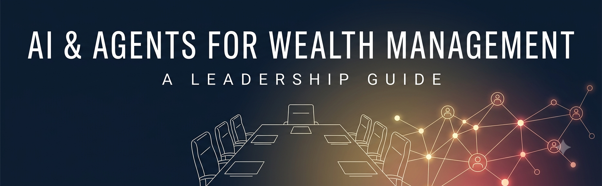

# AI & Agents: A Leadership Guide for Asset & Wealth Management

**A strategy the board can govern, the CEO can own, and the firm can actually run. The technology is the easy part — this guide is about everything around it.**

Most AI material aimed at our industry starts with the model and works outward. This one starts where the decision actually lives: in the boardroom and the C-suite. AI and agents will reshape how an asset and wealth manager researches, advises, operates, and competes — but the firms that pull ahead will not be the ones with the cleverest models. They will be the ones whose **leadership decided who owns this, what risk they'll accept, how the work is organized, and how their people are brought along.** Get that right and the technology follows. Get it wrong and the pilots pile up while nothing reaches a client.

This guide is written for four audiences at once, and each can read its own layer:

---

## The one idea, if you read nothing else

An agent that reads a document and drafts a decision is now an afternoon's work. What is hard — and what this guide is about — is everything a regulated fiduciary firm must put around it: **a named owner and the steering committee they chair, a governed risk appetite, an operating model, defined roles, trained people, a way to prove what the system did, and the discipline to run it all as one program.** None of those are technology problems. They are leadership and organizational problems, and they are the ones that decide whether AI becomes a capability or a liability.

Agents are easy. Governance is hard. The firm that wins treats governance and org design not as brakes but as the enabler that lets it move faster than competitors who skipped them.

---

## How to use this guide

Read it top to bottom as a leadership team, or jump to your seat.

### Part I — Leadership & Vision *(start here)*

| | For whom | What it settles |
| --- | --- | --- |
| [**01 — For the Board**](docs/01-for-the-board.md) | Directors | The bet, AI governance as a **fiduciary duty**, the ten questions to ask management, and the board's first-year oversight cadence |
| [**02 — For the CEO & C-suite**](docs/02-for-the-ceo-and-c-suite.md) | CEO, executive team | The AI-first thesis, the three imperatives, the single named owner, and the CEO's first-year execution roadmap |

### Part II — Organization & People *(the heart of it)*

| | What it covers |
| --- | --- |
| [**03 — Operating Model & Org Design**](docs/03-operating-model-and-org.md) | Center of Excellence → **Center of Enablement**, hub-and-spoke, **the AI steering committee that steers the firm-wide lift**, bridge leaders, and how it reports up |
| [**04 — Roles & Personas**](docs/04-roles-and-personas.md) | Who owns what, by name — and the human personas whose work changes: advisor, PM, ops, compliance, service, builder, executive |
| [**05 — Talent & Training**](docs/05-talent-and-training.md) | The tiered curriculum, AI literacy as a duty, and why *not* training is the real risk |

### Part III — Getting Started & Running It

| | What it covers |
| --- | --- |
| [**06 — Getting Started & the Roadmap**](docs/06-getting-started-and-roadmap.md) | A maturity self-assessment, the 0-90 / Q2-4 / Year 2+ roadmap, and what to do Monday |
| [**10 — Program Management & the Dashboard**](docs/10-program-management-and-dashboard.md) | The operating rhythm, and the **one-page executive dashboard** a CEO and board read each month (with a working example) |

### Part IV — Governance, Policy & the Tech That Follows *(secondary, on purpose)*

| | What it covers |
| --- | --- |
| [**07 — The Governance Framework**](docs/07-governance-framework.md) | Model risk (established model-risk regulation), the **agentic-AI gap the firm must fill itself**, NIST AI RMF, EU AI Act |
| [**09 — AI & AI-Agent Policies**](docs/09-ai-policies.md) | Two adoptable policies: **no personal token-burning, and corporate/client data never leaves the walls** — the enforceable version of the framework |
| [**08 — The Data Foundation**](docs/08-data-foundation.md) | The platform agents read from, data products, and access control as a security boundary |

### Reference

| | What it covers |
| --- | --- |
| [**11 — Recommended Reading**](docs/11-recommended-reading.md) | The sources behind the guide, curated by seat — board, C-suite, org, and the technical spine |

---

## The governance idea leaders need to know

If there is one technical fact a board and C-suite should carry into every AI decision, it is this:

The firm's model-risk framework — long-standing supervisory discipline for model risk, now recently modernized — governs traditional models well. But **generative and agentic AI sit explicitly outside that framework's scope.** Classic model risk management does not cover your agents. That governance layer is yours to build, and it is a leadership decision — not something to discover after an incident. [Chapter 07](docs/07-governance-framework.md) lays it out; the working, code-level version is the companion repo [agents-are-easy-governance-is-hard](https://github.com/steviebuchicago/agents-are-easy-governance-is-hard).

---

## Where this sits in the series

This is the **leadership and organizational layer — the why and the who.** The technical "how" lives in the companion repositories:

- [agents-are-easy-governance-is-hard](https://github.com/steviebuchicago/agents-are-easy-governance-is-hard) — the governance concepts, in code
- [crewai-for-beginners](https://github.com/steviebuchicago/crewai-for-beginners) — building your first multi-agent system
- [claude-agents-for-wealth-management](https://github.com/steviebuchicago/claude-agents-for-wealth-management) — the regulated-firm deep end, four production-shaped examples
- [getting-started-with-openclaw](https://github.com/steviebuchicago/getting-started-with-openclaw) — a personal-agent on-ramp

Strategy and org come first. The tech follows.

---

## License

MIT — see [LICENSE](LICENSE). Use it, adapt it, bring it to your own leadership team.

## About

Written by **Stephen A. Barry** — Chief Technology Officer in asset and wealth management, and Professor of AI in the University of Chicago's MS in Applied Data Science. Twenty-five years in financial-services technology, now teaching and building the applied version of this at the graduate level.

[LinkedIn](https://www.linkedin.com/in/stevebarry25/) · [GitHub](https://github.com/steviebuchicago)
