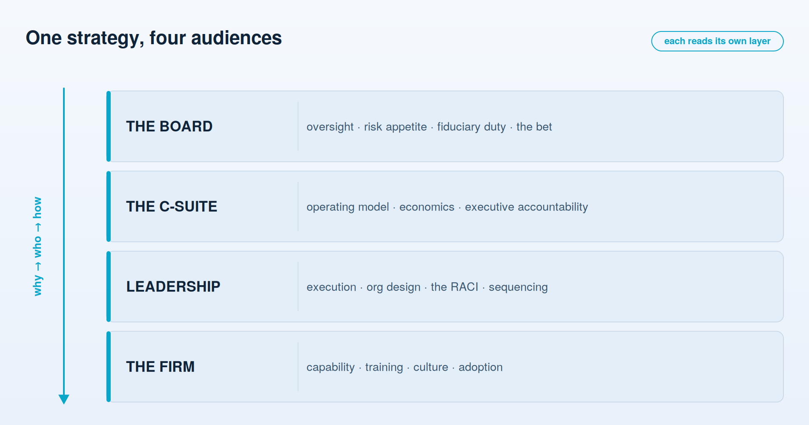
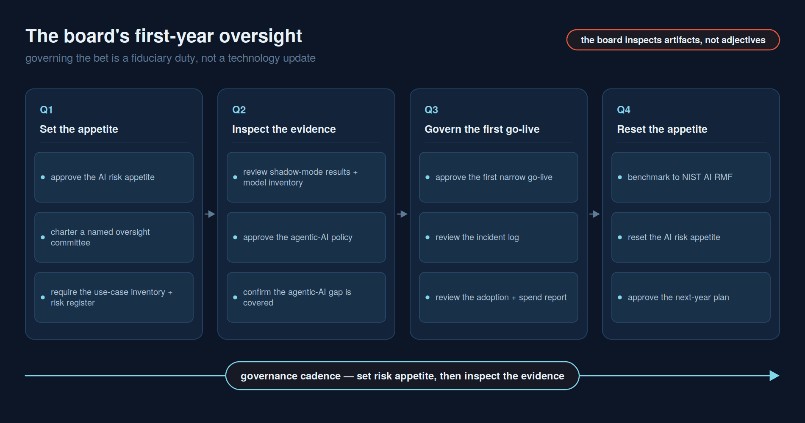

# For the Board

**The strategic bet in one page — and why governing it well is now part of the board's fiduciary duty, not a drag on it.**

The firm faces one real question about artificial intelligence, and it is not whether to use it. It is whether we redesign how the work gets done, or bolt AI onto today's process and wait to be out-competed by a firm that didn't. Everything else — which model, which vendor, which pilot — is detail beneath that decision.

That is the bet. In asset and wealth management the raw material is judgment, trust, and information, and all three are exactly what this technology changes the economics of. A firm that uses AI to compress research, personalize advice at scale, and take cost out of operations will, over a few years, be structurally cheaper and structurally closer to its clients than one that does not. The upside is real. So is the failure mode: a system that acts on a client account, gets it wrong, and leaves no one who can say who approved it or what it did. The board's job is to make the first outcome likely and the second one impossible.

## Governance here is a fiduciary duty

This is the part that has changed, and it is why AI belongs on the board agenda rather than buried in a technology update. Under Delaware law, the duty of oversight — the *Caremark* line of cases — holds directors responsible for ensuring that a reporting-and-monitoring system exists for the risks central to the business, and for not consciously ignoring it. A growing body of guidance, and a widening set of state laws, now treats AI risk as one of those central risks. When an automated system can move money, misstate a client's position, or discriminate in who gets advice, oversight of it is not optional stewardship — it is the duty directors already owe, applied to a new instrument.

The good news is that meeting the duty does not require the board to become technical. It requires the board to insist that management can answer, at any time, three questions for every material AI system: **who owns it, what may it touch, and how do we prove what it did.**

## The four-step board framework

The emerging board playbook is straightforward, and it scales to a firm of any size when it is calibrated to that firm's risk appetite rather than copied wholesale:

1. **Assess.** Require an honest inventory and audit of where AI is already in use — advisor meeting preparation and next-best-action, RFP and DDQ response drafting, client-document intake and classification, KYC/AML and suitability review support, portfolio commentary and research summarization, regulatory-change monitoring, operations reconciliation — including the tools staff adopted without asking, and the risk each one carries. This has a name and a deliverable: an **AI use-case inventory** and an **AI risk register**, not a slide that says "we're exploring AI."
2. **Structure oversight.** Fix clear roles: what the board owns, what management owns, which committee the topic reports through, and how often.
3. **Set risk protocols.** Anchor controls to a recognized framework (NIST AI RMF for the enterprise; the model-risk framework, recently modernized, for models), with rigor proportionate to the risk of each use — not one-size-fits-all.
4. **Enable the opportunity.** Governance is not the finish line. Once the guardrails exist, push to deploy at scale where the value is real.

Notice the order. The controls come before the scaling, deliberately — but the scaling is the point. **Responsible AI governance is a precondition for innovation, not an impediment to it.** A firm that cannot prove what its systems do will, correctly, never be allowed to run them on anything that matters; the discipline is what earns the right to move fast later.

## What to ask to see — artifacts, not adjectives

A board does not assure itself with a confident presentation; it assures itself with the record. For each thing the board cares about there is a specific artifact management should be able to put on the table, and if the artifact does not exist, that absence is itself the finding. Ask for the artifact by name:

| What the board asks | The artifact to put on the table |
| --- | --- |
| Who steers the program across the firm, and who answers for it? | The **AI steering committee charter and decision log** — its membership, its mandate, and the priorities and go/no-go calls it has made, chaired by the one named owner |
| Where is AI actually in use, and what is sanctioned? | The **AI use-case inventory** and the **vendor/tool approval list** — including the shadow tools staff adopted without asking |
| What could go wrong, and who owns each risk? | The **AI risk register**, with a named owner and a control for every entry |
| Which models and agents run, and are they validated? | The **model inventory** — model-risk discipline for the models, the firm's own layer for the agents |
| How do we know a system is right *before* it acts? | The **shadow-mode accuracy and exception report** — measured performance against real cases ahead of go-live |
| What has actually gone wrong, and was it caught? | The **incident log**, with each incident triaged, escalated, and closed |
| Is the value real and the spend controlled? | The **adoption, usage, and cost report** — who uses it, for what, at what run-rate |

The discipline compresses to one line: **the board inspects artifacts, not adjectives.** "It works well" is an adjective. The shadow-mode exception report is an artifact.

## Ten questions to put to management

The board does not build the controls. It asks the questions that reveal whether they exist. These ten are enough to separate a governed program from a hopeful one:

1. Which AI and agentic systems are in use today, who owns each, and what can each one touch?
2. Which committee owns AI risk, and how often does it report to this board?
3. What recognized framework are our controls anchored to, and is the rigor matched to each system's risk?
4. Our agentic systems fall outside the current model-risk rules — what governance have we built ourselves to cover them?
5. For each material system, who is the *named* accountable executive? ("An engineer merged a PR" is not an answer.)
6. How do we know a system is right before it acts on a client — and how would we know if it were wrong?
7. Can we produce, for a regulator, the record of what a given system decided on a given day, and why?
8. What is our risk appetite for autonomy — where do we require a human in the loop, and who set that line?
9. What is our exposure through vendors and any EU nexus, and who tracks the shifting rules?
10. Are AI outcomes tied to compensation and scorecards, or is this still a side project?

If management answers these crisply, the firm is governing the bet. If the answers are vague, the vagueness *is* the finding — and it is the board's to press on before, not after, something goes wrong.

## Two answers, and how to tell them apart

The shape of an answer — not its confidence — tells the board what it is dealing with. Two of the ten questions do most of the work; here is what a hopeful answer and a governed one sound like side by side.

**"For each material system, who is the *named* accountable executive?"**
- *Weak answer:* "The AI program sits with the technology group; the change went through review and an engineer shipped it." A function is accountable, which means no one is.
- *What good looks like:* "Advisor meeting-preparation and next-best-action is owned by the Head of Wealth Distribution as the accountable executive; the model-risk owner is named in the model inventory; every change clears the Center of Enablement's approval gate and is logged. Here is the inventory entry."

**"How do we know a system is right before it acts on a client — and how would we know if it were wrong?"**
- *Weak answer:* "It has been thoroughly tested and the team is confident; accuracy is high." No evidence on the table, no threshold, no way to detect a failure after go-live.
- *What good looks like:* "KYC/AML and suitability-review support ran in shadow mode against real cases; here is the accuracy and exception report, with every exception triaged and every adverse-action case held for a human. It goes live only above the risk threshold the board set, and a human gate stands in front of any client-affecting decision. Here is the report."

The difference is not tone. It is whether a name, a threshold, and an artifact exist — or do not.

## The board's first-year oversight roadmap

The firm has a build roadmap — owner, platform, use cases, scale — and it lives in [Chapter 06](06-getting-started-and-roadmap.md). The board's roadmap is a different instrument. It is not a plan to build anything; it is a **cadence of oversight** — what the board *sets*, and what evidence it *inspects*, quarter by quarter — so governance is a routine on the calendar rather than a scramble after an incident. It is paced deliberately: set the risk appetite first, then inspect the evidence against it.

**Q1 — Set the appetite.** Approve the firm's AI risk appetite: where autonomy is allowed, where a human must stay in the loop, and what the firm will not do at all. Charter oversight to a named committee — risk or audit — with AI risk on its standing agenda and a defined reporting rhythm to the full board. And require the two foundational artifacts by a date certain: the **AI use-case inventory** and the **AI risk register**.

**Q2 — Inspect the evidence.** Review the first **shadow-mode accuracy and exception results** and the **model inventory** — the proof that systems are measured before they act. Approve the **agentic-AI policy** the firm writes itself to cover what sits outside that framework's scope: permissions, budget caps, audit logging, human gates, and the approvals path.

**Q3 — Govern the first go-live.** Approve the first narrow go-live — a single, bounded slice — against the threshold set in Q1. Review the **incident log** to see how exceptions are caught and closed, and the **adoption, usage, and cost report** to see whether the value is real and the spend is under control.

**Q4 — Review and reset.** Benchmark the year's controls against the **NIST AI RMF** — Govern, Map, Measure, Manage — as an external yardstick. Then reset the risk appetite for year two and approve the next-year plan, so the cadence begins again from a higher base.

None of this asks the board to become technical. Each step is a decision to make or an artifact to inspect — the oversight a fiduciary already owes, put on a calendar.

---

**Next:** [02 — For the CEO & C-suite](02-for-the-ceo-and-c-suite.md) — the vision, the leadership, and the first decisions that turn the bet into how the firm runs.
