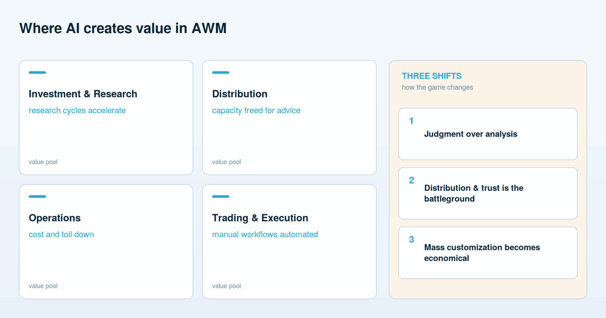
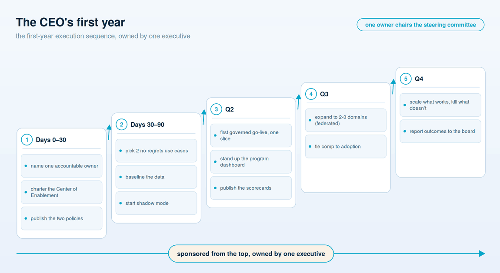

# For the CEO & C-suite

**Lead with vision and leadership, not technology: the AI-first thesis, the shifts it rides, and the first decisions that turn a strategy into an operating reality.**

Start with the leadership stance, because it decides everything downstream. AI is not a technology program the CEO delegates to IT and reviews quarterly. It is a redesign of how the firm creates value, and redesigns of that kind are led from the top or they do not happen. The single biggest predictor of whether a firm gets real return is not its model, its budget, or its data — it is whether the person at the top treats this as their own agenda, with their own name on it, or as something the organization will sort out below them. The technology follows the vision; it does not supply one.

The temptation, at the executive level, is to run AI as a portfolio of pilots — fund a dozen, see what sticks, scale the winners. The evidence of the last two years is that this does not work at the scale that matters. Pilots optimize a task; they do not change the economics of the business, because the process around the task is untouched. The firms pulling ahead are treating AI as **structural redesign** — rebuilding how a workflow is done, not decorating it with a copilot. In an agentic era, incremental approaches are no longer sufficient, and "we ran some pilots" is not a strategy a board should accept as one.

## The three shifts the bet rides on

Structural redesign is worth the discomfort because it rides three shifts in what actually creates value in this industry.

**Judgment over analysis.** When the cost of producing analysis falls toward zero, analysis stops being the differentiator. What remains scarce — and therefore valuable — is judgment: knowing which question to ask, which output to trust, when to override the machine. The firm's edge migrates up the stack, from producing information to deciding with it.

**Distribution and trust become the battleground.** If every firm can generate comparable research and comparable portfolios, the contest moves to the relationship — who reaches the client, who is trusted, who is present at the moment a decision gets made. AI that deepens that relationship is worth more than AI that only cuts a cost.

**Mass customization becomes economical.** Tailoring advice, reporting, and communication to each client used to be a luxury reserved for the largest accounts. The economics of that invert. Personalization at the scale of the whole book becomes affordable, and clients will come to expect it.

## Where the value shows up

It helps to be concrete about the map without pretending there are numbers to underwrite. Published ranges exist; treat them as illustrations of *direction*, not as figures to book into a plan. The value concentrates in four places:

- **Investments and research.** Concretely: portfolio commentary and research summarization, and regulatory-change monitoring — faster, broader synthesis of filings, news, and internal notes; more coverage per analyst; sharper preparation for the judgment calls that remain human. The gain is quality and reach, not the removal of the investor.
- **Distribution and advice.** Concretely: advisor meeting preparation and next-best-action, and RFP and DDQ response drafting — preparation, note-taking, and follow-up taken off client-facing people's plates, plus personalization that would never have been economic by hand. The metric that matters is client-facing hours freed, and what gets done with them.
- **Operations.** The clearest near-term returns: client-document intake and classification, KYC/AML and suitability review support, and reconciliation — the high-volume back-office work where capacity rises and unit cost falls. This is usually where a firm should start.
- **Trading and execution.** Automation of the manual, repeatable parts of the workflow, with humans supervising exceptions rather than processing the routine.

The honest caveat: those returns are gross. Net of the governance, data, and change-management work described across this guide, they are still real — but a business case that books the gross and skips the bill is the business case that stalls at the risk committee.

## Three imperatives for the people at the top

**Be bold.** Aim at structural redesign, not tool adoption. A firm that measures success by seats of a chatbot licensed has confused activity with transformation.

**Focus.** Put capital behind a small number of programs with a clear line to P&L, and starve the science projects. Spreading the budget thin across everything interesting is how two years and a real number get spent producing a chatbot that summarizes meeting notes.

**Go deep.** The work is operating model, talent, and process — not technology alone. The model is the easy part; it already works. The transformation is in everything around it, and that is where executives, not vendors, have to lead.

## An owner, top-led sponsorship, and hardwired incentives

**Name one owner — who chairs the committee that steers it.** The most important sentence in the operating model is the one that names a single accountable executive for the AI program — one leader with the mandate, the budget, and the exposure. A firm-wide lift this large is *steered* by a cross-functional [AI steering committee](03-operating-model-and-org.md#the-ai-steering-committee--the-body-that-steers-a-firm-wide-lift) — leadership and key personnel who prioritize, allocate, and unblock across the whole firm — but steered is not owned. This one leader chairs that committee and answers for the result; the committee coordinates, and a committee cannot be held to account. "Technology and the businesses jointly" is not accountability, and diffuse accountability is the reason transformations drift. A committee to steer; a name to answer.

**Sponsor it from the top, with sustained capital.** The owner needs air cover the organization can see — a CEO who returns to this in every operating review, not a launch memo and silence. Transformations funded in a burst and then left to fend for themselves lose to the next quarter's priorities. The signal that this is permanent, not a campaign, comes from the top or not at all.

**Hardwire the incentives.** Transformation that is nobody's objective is everybody's optional extra. AI outcomes have to appear in compensation and in the scorecards leaders are measured on, the same as revenue or risk. Fluency with these tools belongs in hiring, promotion, and pay — not as a slogan, but as a line item people are actually assessed against.

## How to get started: the first three decisions a CEO makes

Before any platform, any pilot, any vendor, the top of the house makes three decisions. None of them is technical, and all three are the CEO's to make.

1. **Declare it structural, and say so out loud.** Name AI-first as the firm's strategy, owned at the top and aimed at redesigning the work — not a productivity tool the businesses may adopt if they like. The declaration is what gives everything below it permission to move.
2. **Name the one accountable owner, and convene the committee they chair.** Put a single C-level executive on it, with the mandate, the budget, and the exposure — and stand up the cross-functional AI steering committee they will chair, so the firm-wide lift is steered by leadership together while one person answers for it. This is the decision most often ducked, and the one that most determines whether anything ships.
3. **Put it in the scorecard.** Decide, on day one, that AI outcomes are measured and that leaders are compensated against them. What is not on the scorecard is not real, and everyone in the building knows it.

Those three decisions cost nothing and are the difference between a firm that transforms and a firm that pilots for two years. The board sets the appetite; the C-suite makes these calls; the rest of this guide is how the firm then organizes, staffs, and governs to deliver on them.

## The CEO's first-year execution roadmap

The three decisions above are day one. This is the year that follows — an **execution sequence**, not an oversight cadence and not the firmwide build plan (that lives in [Chapter 06](06-getting-started-and-roadmap.md)). It is the order in which the accountable owner actually moves: sponsored from the top, owned by one executive who chairs the steering committee that helps them prioritize.

**Days 0-30 — put a name and a boundary on it.** Name the single accountable executive owner. Charter the **Center of Enablement** — even in minimal form — as the hub that sets standards and runs the approval gate. And publish the two policies people need before they touch anything: the AI use policy, and the **agentic-AI policy** that covers what the model-risk framework does not.

**Days 30-90 — pick the ground and baseline it.** Choose exactly two no-regrets use cases — high value, low resistance, a boring cost of error, almost always in operations: client-document intake and classification, or operations reconciliation. Baseline the data they depend on, honestly. Then start them in **shadow mode**, so they earn the right to go live on evidence rather than on a demo.

**Q2 — ship one governed slice.** Take the first use case to a **governed go-live** in one narrow slice — not the whole book. Stand up the program dashboard and the scorecards at the same time, so adoption, usage, cost, and exceptions are visible from the first day of production rather than reconstructed later.

**Q3 — widen through the federated model.** Expand to two or three domains — advisor meeting preparation and next-best-action in distribution, KYC/AML and suitability review support in risk and compliance — with each business building on the platform rather than reinventing it. Tie incentives and compensation to adoption, so the transformation is nobody's optional extra.

**Q4 — scale what works, kill what doesn't.** Double down on what cleared its thresholds, stop what did not, and report outcomes to the board against the appetite it set — closing the loop with the oversight cadence in [Chapter 01](01-for-the-board.md).

That is an execution sequence, and it is deliberately different from the board's oversight cadence: the board sets the appetite and inspects the evidence; the owner picks the ground, ships the slice, and scales what works.

---

**Next:** [03 — The operating model & org design](03-operating-model-and-org.md) — the structure that turns the owner's mandate into delivery across the firm.
