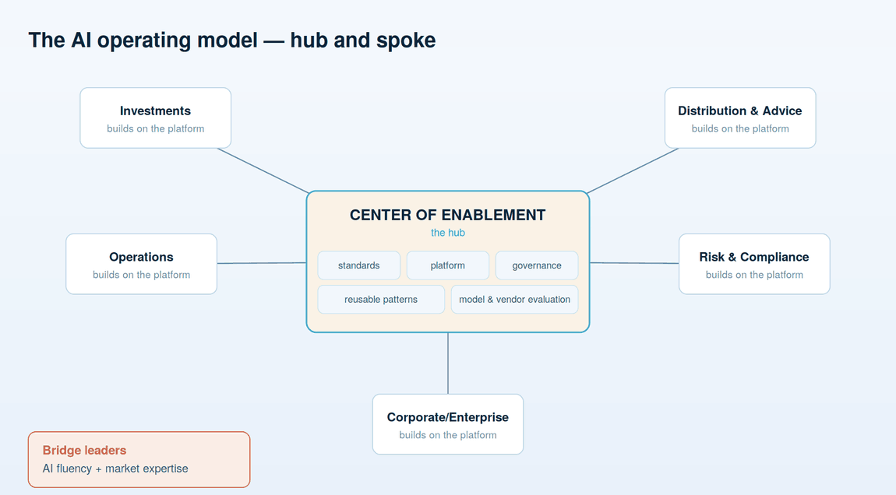
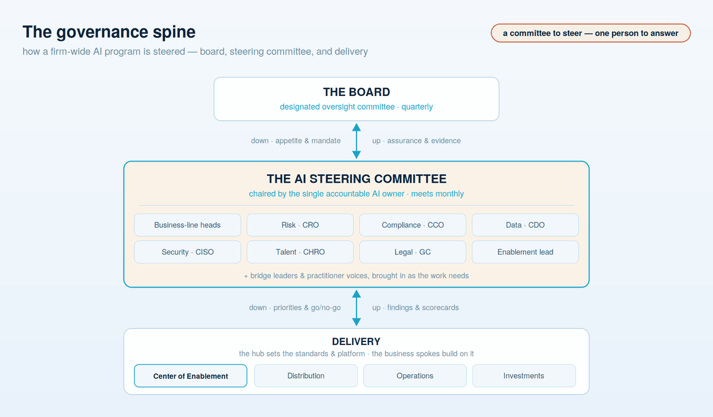

# The operating model & org design

**How the firm organizes to deliver AI without stalling in a central bottleneck or fragmenting into a hundred incompatible experiments — and how that structure reports up to the one accountable owner.**

The owner named in the previous document has a mandate. This document is the machine that mandate runs. Get the org design wrong and delivery either chokes in a central queue or scatters into sprawl no one can govern. Both failure modes are common, both are avoidable, and choosing between them is a leadership decision about structure — not a technical one about tools.

## From a Center of Excellence to a Center of Enablement

Most firms start with an AI Center of Excellence — a small central team that experiments, builds the first systems, and holds the scarce expertise. That is the right way to begin, and the wrong way to stay. A CoE that keeps building everything becomes the bottleneck through which all AI work must pass, and delivery slows to the speed of one team. The evolution that scales is from a Center of *Excellence* to a Center of *Enablement*: the center stops being the only builder and becomes the thing that makes everyone else able to build.

The structure that supports this is **hub-and-spoke**, sometimes called federated. The **hub** owns what should only be decided once: standards, the shared platform, governance, reusable patterns, and the evaluation of models and vendors so that fifty teams are not each running their own bake-off. The **spokes** are the business units, who own delivery — building the systems their domain needs, on the hub's platform, within the hub's guardrails. The hub does not build the businesses' agents for them; it makes it safe and fast for the businesses to build their own.

## Centralized stalls, decentralized fragments

The failure modes on either side are worth naming because firms fall into both. **Centralized stalls** — one team cannot possibly understand distribution, operations, and investments deeply enough to serve them all, and the queue behind it grows without end. **Decentralized fragments** — every unit picks its own tools, its own definitions, its own controls, and the firm ends up with sprawl no one can govern. Hub-and-spoke is the deliberate middle: common where commonality matters, autonomous where local knowledge matters. The hub holds the things that are dangerous or wasteful to duplicate — the platform, the governance, the model and vendor evaluations. The spokes hold the things that depend on knowing a business — what to build, for whom, and whether it is worth building.

## Bridge leaders make it work

The people who make this model work are a specific and scarce type. Call them **bridge leaders** — individuals with genuine AI fluency *and* real market and domain expertise. They are rare precisely because those two skill sets usually live in different people, and the whole design depends on having some who hold both: enough technical understanding to know what is possible and what is nonsense, enough business understanding to know what is worth doing. Identifying, developing, and retaining bridge leaders is a talent priority, not an afterthought — they are the connective tissue between the hub and the spokes, and the single point most operating models are missing when they stall.

## How it reports up to the owner

An operating model without a clear line to the accountable executive is an org chart, not accountability. The reporting is what keeps the structure honest.

The **Center of Enablement lead runs the hub and reports to the named AI owner** — the single C-level executive from the previous document. The hub is not a peer that negotiates with the businesses; it carries the owner's mandate for standards, platform, and governance, and it is measured by how much the spokes ship safely, not by how much the center builds itself.

Each **spoke has an AI product owner accountable inside their business unit** for what gets built and whether it earns its keep. They report through their own business leadership for delivery and P&L, and they align to the hub's standards for how things are built and governed. That dual line is deliberate: the business decides *what* is worth doing; the hub decides *how* it is allowed to be done.

And the whole structure rolls up through the owner to the board's oversight committee. **Governance findings, incidents, and the scorecards that track adoption and value flow up the same line** — from the spokes and the hub, to the accountable owner, to the committee that answers to the board. When the board asks who is accountable for a given system, the operating model should produce a name in one step, not a shrug across three functions.

## The AI Steering Committee — the body that steers a firm-wide lift

Implementing AI across a regulated firm is not a project one executive runs alone from a corner office. It touches distribution, investments, operations, risk, compliance, data, security, and HR at the same time, and it competes for budget and people against everything else the firm is doing. A lift that large needs a **standing cross-functional body that steers it** — a place where the whole leadership team sets priorities, allocates resources, and unblocks the work, so AI is governed as one firm-wide program rather than as a dozen disconnected departmental efforts. That body is the **AI Steering Committee**, and standing it up is one of the first structural moves a firm makes.

At first glance this sits in tension with the guide's insistence on a *single named owner*. It does not, and the distinction is the most important thing to get right: **a committee to steer, one person to answer.** The steering committee is chaired by the single accountable AI owner. The committee provides coordination, cross-functional buy-in, and firm-wide prioritization; the chair carries the accountability. Responsibility never dissolves into "the committee decided," because a committee cannot be held to account by a regulator or a board — a person can. The committee is where the firm *steers*; the chair is who *answers.* Keep those two ideas separate and the structure is sound; blur them into "the committee owns it" and accountability quietly evaporates, which is exactly the failure this whole guide exists to prevent.

**Who sits on it.** Leadership and the key personnel whose functions the program depends on: the heads of the business lines that will actually deliver and adopt (distribution, investments, operations), and the functional leaders who own the constraints — the Chief Risk Officer, the Chief Compliance Officer, the Chief Data Officer, the security lead, the head of talent, and Legal. The Center of Enablement lead is there as the hub. Bridge leaders and senior practitioners are pulled in as the agenda needs them, so the committee hears from the people doing the work and not only from the people reporting on it. The membership is senior enough to commit resources and decide, and cross-functional enough that no major constraint is discovered late.

**What it actually decides.** The committee is a decision-making body, not a status meeting. It sets the **portfolio priorities** — which use cases get funded, which get killed, and in what order — so the firm concentrates its scarce AI talent instead of spreading it thin. It **allocates budget and people** across the spokes. It **adopts the cross-cutting standards and the two policies**, and holds the businesses to them. It makes the **go/no-go call on consequential go-lives**, operationalizing the risk appetite the board set into concrete decisions on concrete systems. And it **removes the blockers** that no single business unit can clear alone — a data-access boundary, a vendor-approval logjam, a contested definition of "client." If a decision needs more than one function to agree, it belongs here.

**What it must never become.** The failure mode is a committee that meets, discusses, and decides nothing — a place where accountability goes to be diffused. Three disciplines keep it honest: the chair is the named owner and carries the accountability out of the room; every decision leaves with a named individual responsible for executing it; and it runs on the same evidence the rest of the program does — the [program dashboard](10-program-management-and-dashboard.md), not a separately assembled deck. The committee steers using the same instruments the board and the delivery teams read, so there is one source of truth at three altitudes.

**How it connects, up and down.** The steering committee is the middle of the governance spine in the diagram above. Above it, the **board's designated committee** meets quarterly to set the risk appetite and inspect the evidence; the steering committee sends assurance up and takes mandate down. Below it, the **delivery organization** — the Center of Enablement hub and the business spokes — builds and runs the systems; the steering committee sends priorities and go/no-go decisions down, and takes findings, scorecards, and incidents up. It meets on a monthly cadence, between the board's quarterly oversight and the delivery teams' weekly rhythm, which is exactly the operating rhythm the [program-management chapter](10-program-management-and-dashboard.md) lays out.

That structure — a hub that sets standards and platform, business units that deliver, a steering committee that prioritizes and unblocks across the firm, governance woven through, and one accountable owner chairing it all — is the shape the rest of this guide fills in. The next two documents put people into it: first the roles that must exist by name and the personas whose work changes, then the training that makes any of it safe.

---

**Next:** [04 — Roles & personas](04-roles-and-personas.md) — who is accountable by name, and whose day actually changes when the agents arrive.
