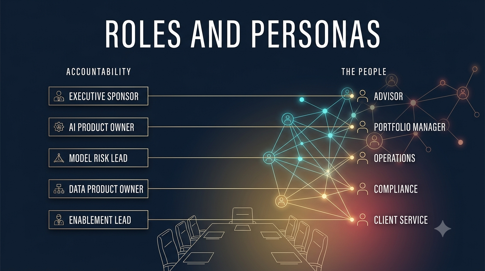
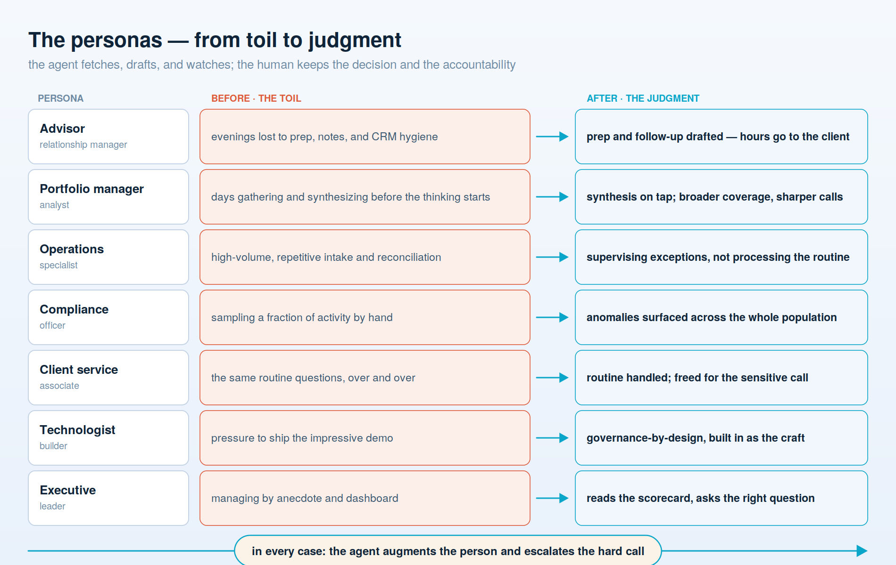

# Roles & personas

**Who is accountable by name, and whose work actually changes — the organization-and-culture layer, set before any technology.**

The operating model in the previous document is a shape. It becomes real only when specific people own specific things, and specific people's jobs change. This document names both — the roles that must exist by name, because "the system did it" is not an answer a regulator or a board will accept; and the people whose day changes when agents arrive, with what they fear, gain, and need from leadership. In a well-run firm, agents *augment* judgment and *escalate* the hard call to a human; they do not replace the person who is accountable for it. Keeping that true is a leadership choice, made here in how roles and expectations are set — not a property of the technology.

## The roles that must exist by name

Each role below: what they own, and what "good" looks like.

**Executive Sponsor / named AI owner.** Owns the AI program end to end — the mandate, the budget, and the exposure. This is a single C-level executive who *chairs* the firm's AI steering committee but is never replaced by it: the committee steers, this person answers. Good looks like a person whose name the board can say out loud, who does not dilute the accountability into "the businesses jointly."

**The AI Steering Committee.** The cross-functional body that steers the firm-wide lift — leadership and key personnel (business-line heads, risk, compliance, data, security, talent, Legal, and the Center of Enablement lead) who set portfolio priorities, allocate budget and people, adopt the standards and policies, make the go/no-go call on consequential go-lives, and clear the blockers no single unit can. Chaired by the named AI owner above. Good looks like a decision-making body that leaves every meeting with named individuals owning named actions — not a monthly status meeting where accountability goes to be diffused. A committee to steer; a person to answer. ([The full picture is in the operating-model chapter.](03-operating-model-and-org.md#the-ai-steering-committee--the-body-that-steers-a-firm-wide-lift))

**AI Product Owner(s), per domain.** Own what gets built in a business domain — distribution, operations, investments — why, and whether it earns its keep. Good looks like a roadmap tied to a P&L line and a willingness to kill a use case that isn't working, rather than a backlog of demos.

**Model Risk / Independent Validation lead.** Owns the challenge function for models under the model-risk framework, recently modernized — validation by someone who did not build the thing. Good looks like independence that is real on the org chart: this person can refuse a go-live and not be overruled by the team whose bonus depends on shipping.

**Agentic-AI Governance owner.** The gap-filler. Because the model-risk framework explicitly excludes generative and agentic systems, someone must own the bespoke layer that governs them — the gates, the approvals, the shadow-mode discipline. Good looks like a named owner for the exact risk the regulation leaves uncovered, rather than an assumption that model risk "probably has it."

**Data Product Owner(s).** Own the domain data products the agents read from — quality, lineage, and the access boundary. Good looks like a person accountable for what "client" means here and who may see it, set once and enforced rather than reinvented by every team.

**Center of Enablement lead.** Runs the hub: standards, the shared platform, reusable patterns, and model and vendor evaluation. Good looks like a leader measured by how much the spokes ship safely, not by how much the center builds itself.

**Security & access owner.** Owns the access-control perimeter every agent operates inside — the boundary the code enforces and the model may never move. Good looks like permissions denied by default and an allowlist scoped to what a system *could* reach if it went wrong, not what it uses on a good day.

**Compliance / Legal partner.** Owns the regulatory read — the model-risk framework's scope, EU AI Act exposure, disclosure and suitability — embedded early rather than consulted at the end. Good looks like a partner in the room when a use case is designed, whose concerns shape it instead of blocking it in month four.

**The Board's designated oversight committee.** Owns oversight on the board's behalf: which committee hears AI risk, how often, and against which framework. Good looks like a standing agenda item and a committee that can answer the ten questions from the board document without phoning a vendor.

**Accountability, one line per decision.** The test of all of the above is whether a human's name finishes each sentence. *Go-live:* the named AI owner is accountable, the Model Risk or Agentic-AI Governance lead validates, Compliance is consulted, and approval runs through change management by a person — never an engineer merging a PR. *Budget:* the Executive Sponsor is accountable, informed by the domain AI Product Owners. *Model or vendor approval:* the Center of Enablement lead is accountable for the evaluation, with independent validation as the check. *Incident:* the named AI owner is accountable for the response, the Security & access owner and the relevant Data Product Owner act, and the board committee is informed. If any of these can only be finished with "the system" or "the team," that decision does not yet have an owner.

## The personas — whose work changes

These are the people the strategy is actually about. In every case the human keeps the decision; the agent does the fetching, drafting, and watching, and raises its hand when unsure.

**The Financial Advisor / relationship manager.** *Before:* evenings lost to meeting prep, note-taking, and CRM hygiene, with the personal touch rationed to the biggest accounts. *After:* preparation, summaries, and follow-up drafted for them, so scarce hours go to the client conversation and the judgment call. *What they need:* the explicit message — and the incentive — that freed time goes into deeper relationships, not a higher account count per head. Their fear — that the machine depersonalizes what is their whole value — is answered by leadership's measures, not by the tool.

**The Portfolio Manager / analyst.** *Before:* days spent gathering and synthesizing filings, news, and internal notes before the thinking can even start. *After:* synthesis on tap, broader coverage, sharper preparation for the calls that stay human. *What they need:* verification habits and the standing permission to override the machine — judgment over analysis, made explicit — so they are never asked to trust an output they cannot see inside.

**The Operations specialist.** *Before:* high-volume, repetitive intake, reconciliation, and servicing — the work most exposed to automation. *After:* supervising exceptions and edge cases rather than processing the routine. *What they need, honestly:* a straight answer about the path from processor to supervisor-of-agents, and the training to walk it. "Augmented" has to mean augmented — proven by investing in the person, not thinning the desk.

**The Compliance officer.** *Before:* sampling a fraction of activity by hand, always a step behind. *After:* agents surface anomalies across the whole population and escalate the genuine ones. *What they need:* explainability and audit trails good enough to sign their name under, and a seat when systems are designed, not just reviewed after the fact.

**The Client Service associate.** *Before:* the same routine questions, over and over, at the cost of the complex ones. *After:* the routine handled or drafted, the person freed for the sensitive call that needs a human. *What they need:* to be measured on resolution quality, not just handle time, so the tool is used to serve the client rather than to speed the queue.

**The Technologist / builder.** *Before:* pressure to ship the impressive demo, with governance treated as someone else's cleanup. *After:* governance-by-design as the craft — the audit log and the shadow path built in from the start. *What they need:* the standards, patterns, and platform from the Center of Enablement, so the safe path is also the fast one and "move fast" stops fighting "be accountable."

**The Executive.** *Before:* managing by anecdote and dashboard, one remove from the work. *After:* reading a scorecard, asking the right question in an oversight meeting, and visibly using the tools themselves. *What they need:* leadership-tier training — enough to interpret the evidence their own governance produces, and to know where their accountability begins and ends.

Across every one of these, the same line holds: the agent augments the person and escalates the hard call; the human keeps the judgment and the accountability. That outcome is not what the technology does on its own — it is what these roles and expectations, set deliberately, make it do.

---

**Next:** [05 — Talent & training](05-talent-and-training.md) — how the firm builds the fluency every one of these people needs.
