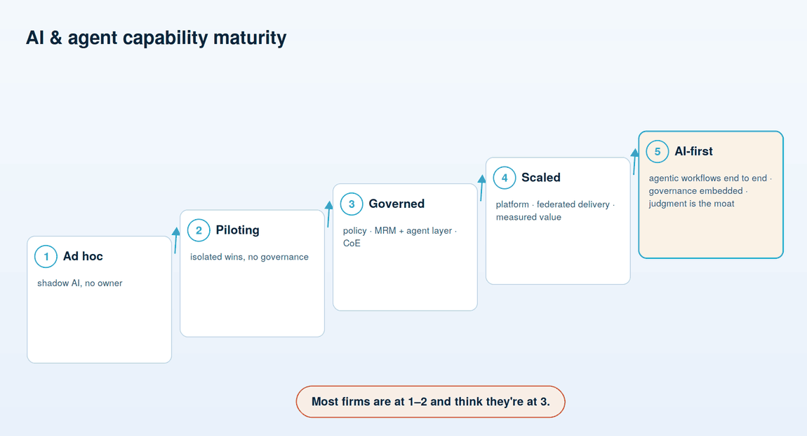
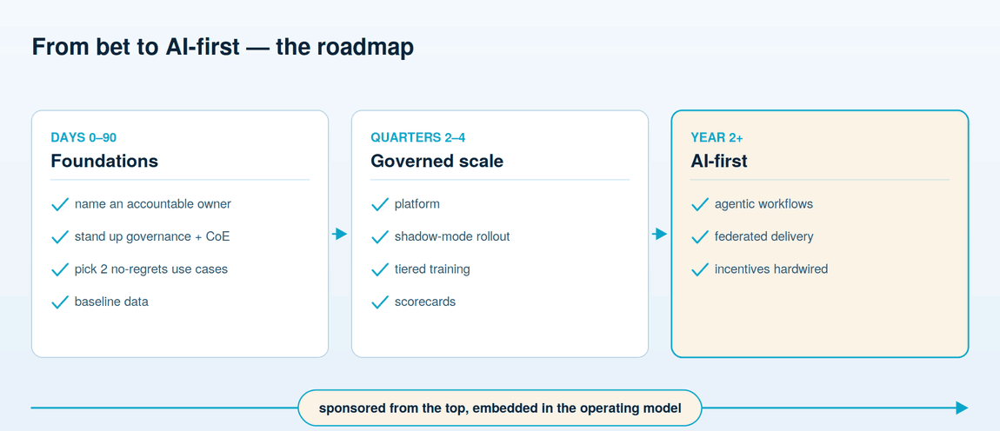

# Getting started & the roadmap

**An honest read of where the firm actually stands, the sequence from here — ninety days, then the year, then the real transformation — and the short list to start on Monday.**

Every firm believes it is further along than it is. That is the first thing to correct, because a roadmap built from the wrong starting point routes around the work that actually matters. So begin with an honest self-assessment against five stages, and resist the urge to round up.

## Five stages of maturity

| Stage | What it looks like | You're probably here if |
| --- | --- | --- |
| **1 · Ad hoc** | Staff use AI on their own, no owner, no policy | You cannot name who owns AI, and "shadow AI" describes most of your usage |
| **2 · Piloting** | Isolated wins, enthusiastic teams, no governance | You have impressive demos but nothing running against real client data |
| **3 · Governed** | Policy, MRM plus an agent layer, a CoE stood up | There is a named accountable owner and a framework agents actually pass through |
| **4 · Scaled** | A platform, federated delivery, value measured | Business units build on a shared platform and you can quantify the return |
| **5 · AI-first** | Agentic workflows end to end, governance embedded | The redesign is done, and judgment — not analysis — is the moat |

The pattern worth internalizing: **most firms are at stage 1 or 2 and are convinced they're at 3.** The tell is the gap between demos and production. Stage 2 has plenty of things that work; stage 3 has things that are *allowed* to run, because the governance, the owner, and the evidence exist. If the firm has impressive pilots but cannot answer the board's ten questions from the first document in this guide, it is at stage 2, and the honest label is the useful one — it points straight at what to build next.

## The roadmap

The sequence below is deliberately front-loaded with governance and ownership, because those are what convert pilots into things that ship. It is not a bet on a distant payoff; the no-regrets use cases return value inside the first quarter.

**Days 0-90 — put a floor under it.** Name the single accountable owner. Stand up the governance framework and the Center of Enablement, even in minimal form — a policy, the model-risk process extended, and the beginnings of the agentic-AI layer that fills the gap left by the model-risk framework. Pick exactly two no-regrets use cases — high value, low resistance, boring cost of error, almost certainly in operations — and start them. And baseline the data: an honest audit of what exists, what it would take to make it usable, and where the real gaps are. The goal of the first quarter is not scale. It is a foundation that later work can safely stand on.

**Quarters 2-4 — build the machine.** Stand up the unified data platform as a funded program with its own owner. Roll out agents in shadow mode as the default, so they earn the right to go live on evidence rather than on a demo. Launch the tiered training curriculum across all four tiers, all-staff through leadership. And put scorecards in place — the instruments that make AI outcomes visible and hold the named owners to them. By the end of the first year the firm should have a platform, a trained workforce, and systems running under real governance.

**Year 2 and beyond — transform, don't decorate.** This is where structural redesign actually happens: agentic workflows that run end to end rather than assisting a step, federated delivery where business units build on the platform at their own pace, and incentives hardwired into compensation and promotion so the transformation is nobody's optional extra. Stage 5 is not a place you arrive by buying more tools. It is a place you arrive by having done the unglamorous work in the right order.

## Start here Monday

The roadmap above is quarters and years. The list below is this week. None of it requires a platform, a vendor, or a budget cycle — it requires decisions a CEO and board can make now, and it is what separates a firm that begins from a firm that studies the problem for another two quarters.

1. **Name the owner.** One C-level executive, accountable for the AI program, on the record. Do this first; everything else waits on it.
2. **Commission the inventory.** Ask for an honest audit of where AI is already in use — including the tools staff adopted without asking — and the risk each one carries.
3. **Put AI risk on a committee's standing agenda.** Decide which board committee owns it and how often it reports, so oversight is a routine, not a fire drill.
4. **Pick two no-regrets use cases.** High value, low resistance, boring cost of error, almost certainly in operations. Two, not twelve.
5. **Ask management the ten questions.** The ones from the board document. The quality of the answers tells you your real maturity stage in an afternoon.
6. **Set the scorecard expectation.** Announce that AI outcomes will be measured and that leaders will be assessed against them. What is on the scorecard becomes real; what is not, does not.

Do these six and the firm has moved from stage 1 to the beginning of stage 3 in a week — not because the work is done, but because it now has an owner, a boundary, and a plan, which is exactly what stages 1 and 2 lack.

Strip away the frameworks and one sentence remains, the same one that runs through every repository in this series: **agents are easy; governance is hard.** The firm that wins is not the one with the cleverest models — those are a commodity, available to every competitor. It is the one that treats governance as the enabler that earns its systems the right to run on what matters, while others are still explaining why last spring's demo is on hold pending review.

---

**Next:** [07 — The governance framework](07-governance-framework.md) — the technical spine that follows the strategy and the org: the model rules, the agent rules you write yourself, and the framework that ties them together.
