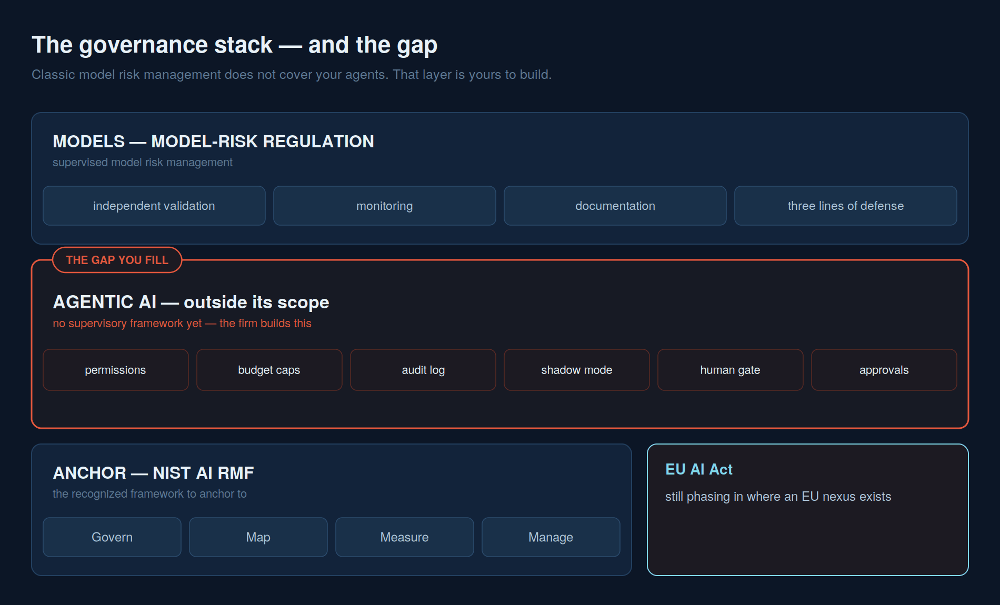

# The governance framework

**Three layers: the model rules you must follow, the agent rules you must write yourself, and the framework that ties them together.**

*Strategy and org come first; this is the technical spine that follows.* Everything to this point has been leadership, organization, and people — deliberately, because that is where AI transformations are won or lost. This document and the next describe the technical layers beneath that work. They matter, and they are secondary: a firm with a perfect governance stack and no owner, no operating model, and no trained workforce has a binder, not a program.

Most of what a firm needs to govern AI already exists in one of three layers. The mistake is to assume the first layer covers all three. It does not — and the gap in the middle is not a matter of opinion. It is written into the regulation. This document walks the stack from the bottom up, because the bottom is where the rules are clearest and the top is where the firm has to do its own thinking.

## Layer one — models, under established model-risk regulation

Financial firms have governed quantitative models for over a decade under **established model-risk management regulation**, the long-standing Federal Reserve and OCC guidance on model risk management. Its logic is durable: a model is a risk, it needs an owner, it needs validation by someone independent of the people who built it, it needs monitoring once it is live, and all of that needs documentation an examiner can read. Three lines of defense sit underneath it.

That framework has recently been modernized — an update, not a reversal — and its stated spirit is "precision over volume, risk alignment over uniformity, governance effectiveness over procedural rigidity." In practice that means three things. It tailors expectations to the size and complexity of the firm — proportionality, not one binder for everyone. It narrows the definition of a "model" so that simple calculators and spreadsheets stop consuming validation effort that belongs elsewhere. And it times validation to materiality, so the highest-risk models get the deepest scrutiny and low-risk ones do not drown in process.

What did **not** change is the part that matters most, and firms should not read modernization as relaxation. Strong governance and clear accountability, independent challenge, validation discipline, vendor accountability, and documentation all survive intact. If anything, the modernization sharpens them by clearing away the busywork that used to obscure them. For the firm's statistical and machine-learning models, this layer is well understood and largely solved.

## Layer two — the gap, where the agents live

Here is the sentence that should reshape the firm's roadmap: **generative and agentic AI systems fall explicitly outside the scope of the model-risk framework**, flagged by the regulators for separate treatment at some later date. This is not an oversight to exploit. It is a warning to act on. Classic model-risk management — the discipline the firm has spent a decade perfecting — **does not cover your agents.** An agent that reads a document, decides something, and takes an action is not a model in the model-risk sense, and the controls built for models do not reach it.

So the firm has a choice it cannot avoid: build a distinct agentic-AI governance layer itself, or run agents with no governing framework at all. There is no third option where someone else has already written the rules. This is the governance gap, in regulation, in writing — and filling it is the single most important piece of AI governance work a firm will do this cycle.

The working version of that layer is concrete, not abstract, and it comes down to five gates plus a formal approval:

- **Permissions** — an explicit allowlist of what the agent may touch, denied by default. Not "what it uses" — what it *could* reach if it went wrong.
- **Budget** — a hard cap on what it may spend, so a retry loop becomes a stop, not an invoice.
- **Audit** — every decision logged, with the version of the prompt that produced it, so you can reconstruct what happened on a given day.
- **Shadow mode** — the agent runs against live traffic and writes nothing, logging what it *would* have done, until the disagreement rate with a human is boring.
- **A human gate** — going live is a decision a named person makes through a change-management approval, not a flag an engineer flips.

These five, and the working code behind them, are the subject of the companion repository [agents-are-easy-governance-is-hard](https://github.com/steviebuchicago/agents-are-easy-governance-is-hard) — the same agent built twice, once as an afternoon demo and once accountable, so the cost of the gates is visible rather than argued. That repo is the buildable version of this layer; this document is the reason the board should insist on it.

## Layer three — the anchor: NIST AI RMF and the EU AI Act

The two lower layers need a frame that covers the whole enterprise, models and agents alike. The recognized one to anchor to is the **NIST AI RMF**, the voluntary framework organized around four functions — **Govern, Map, Measure, Manage**. Govern sets the culture and accountability; Map identifies context and risk; Measure tests and monitors; Manage acts on what the measurement finds. It is deliberately framework-agnostic about tools, which is why it sits comfortably above both the model rules and the bespoke agent layer, and it is the framework a board can point to when asked what its controls are anchored on.

Where the firm has any European nexus — clients, staff, or vendors — the **EU AI Act** applies on top. It sorts uses into risk tiers, adds obligations for general-purpose models, and carries real teeth: fines reach up to 7% of global turnover for prohibited uses. Its timeline is in motion — some high-risk obligations were slated to land early, the EU has since moved to delay parts of the schedule, and the honest posture is to treat it as still phasing in and to confirm the current dates rather than trust any single tracker. The action for now is knowing where the firm's EU exposure sits and who is watching the calendar.

## Who is accountable — three lines, and names

A framework without named humans is a document, not a control. Two things make it real.

The **three lines of defense** carry over cleanly from model risk. The first line is the business — the people who own, build, and run the system. The second line is independent risk and compliance, including the validators who challenge the first line without reporting to it. The third line is internal audit, checking that the whole arrangement works. Agents belong inside this structure exactly as models do, even though the model-risk framework does not put them there.

And the **RACI has to name people, not roles in the abstract.** For every material AI system there is one *named* accountable executive — a person, on the org chart, who answers for it. Validation is done by someone independent of the builder. Go-live is approved by a specific authority through change management. Monitoring has an owner who watches it in production. The test of whether this is real is simple: ask who is accountable for a given system, and if the honest answer is "an engineer merged a PR," the firm does not have accountability — it has a deployment. The point of the whole stack is to make sure that is never the answer.

---

## From framework to enforceable policy

A framework governs; a policy is what people and systems actually obey. The framework above becomes real through two adoptable documents — an **AI Acceptable Use Policy** for everyone who uses AI, and an **AI Agent Policy** for the autonomous systems that act on the firm's behalf. They translate this stack into plain rules: only approved tools, firm business not personal token-burning, and — the rule that matters most — **corporate and client information never leaves the firm's walls.** Both are written out, ready to tailor, in [09 — The policies](09-ai-policies.md).

---

**Next:** [09 — AI & AI Agent Policies](09-ai-policies.md) — the enforceable version · then [08 — The data foundation](08-data-foundation.md).
