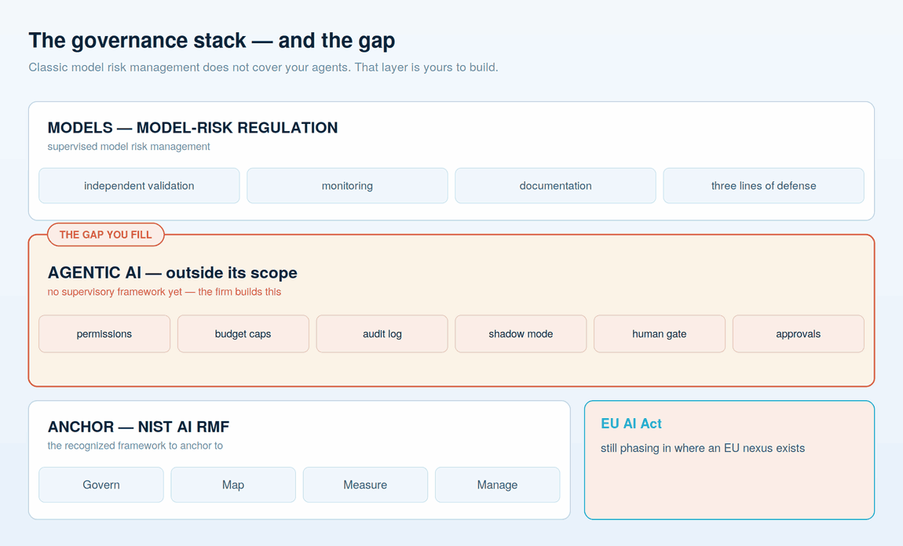

# The policies: AI Acceptable Use & AI Agent Policy

**The governance framework says what to build. These are the two documents that make it enforceable — adapt them, run them past Legal and Compliance, and adopt them.**

Strategy and org design decide *whether* AI is governed. Policy decides *how it feels on a Tuesday* — what an employee may type into a chatbot, which tools are sanctioned, what an autonomous agent is allowed to touch, and what happens when someone gets it wrong. A guide without policy is a philosophy. Below are two working policies a regulated asset and wealth management firm can adopt: one for **people using AI**, one for **agents acting on the firm's behalf.** They are templates, deliberately plain, meant to be tailored to your firm's risk appetite and regulatory footprint — not adopted verbatim without review.

Two firm-specific worries drive most of what follows, and both are legitimate: **we don't want people burning the firm's AI budget on personal projects, and we can never let corporate or client information leave our walls.** Everything below traces back to one of those two, or to the fiduciary duty that sits above them.

---

## Part A — AI Acceptable Use Policy

*Applies to: every employee, contractor, and temporary worker who uses AI tools for firm business.*

### 1. Purpose

The firm supports the responsible use of artificial intelligence to serve clients better and work more efficiently. This policy sets the boundaries that keep that use safe, compliant, cost-effective, and consistent with our fiduciary obligations. It exists to enable AI, not to forbid it — but within lines that do not move.

### 2. Approved tools only

Use AI only through tools the firm has sanctioned. Approved tools are those the firm has vetted, contracted, and configured — with the terms that matter: **our data is not used to train the provider's models, is not retained beyond our instruction, and stays within agreed data-residency boundaries.**

- Do **not** use personal or consumer AI accounts for any firm work.
- Do **not** install AI browser extensions, plugins, or desktop tools that touch firm data without approval ("shadow AI" is the single most common way data leaves the walls).
- If a tool you want is not approved, request it — do not route around the list.

### 3. Business use, not personal use — cost stewardship

Firm-provided AI capacity is a business resource, paid for by the firm, and metered. Use it for firm work.

- Do not use firm AI tools or budget for personal projects, side businesses, or entertainment.
- AI usage is monitored at the account and cost level. Sustained personal or anomalous consumption will be flagged, and access may be adjusted.
- Treat tokens and compute the way you would treat any other firm expense: reasonably, and for the firm's benefit.

### 4. Protecting corporate and client information — the walls

This is the rule that matters most. **Never input confidential firm information, client information, personally identifiable information (PII), material non-public information (MNPI), trade secrets, source code, or proprietary corporate data into any tool that is not approved for that data classification.**

- Know your data's classification before you use it. When in doubt, treat it as confidential and do not enter it.
- Approved tools carry the contractual protections above; unapproved tools do not, and anything entered into them must be assumed to have left the firm permanently.
- Do not attempt to de-identify sensitive data as a workaround unless a documented, approved process allows it.
- Client data used with AI remains subject to every existing privacy, confidentiality, and regulatory obligation the firm already carries.

### 5. Human accountability for output

AI drafts; people decide. **You own any output you use or send, exactly as if you had written it yourself.**

- Verify accuracy, sources, and calculations before relying on AI output — models are confidently wrong on a predictable schedule.
- AI must not be the final decision-maker for regulated advice, suitability determinations, client communications of record, or anything a client relies on, without human review.
- Where regulation or client agreement requires disclosure of AI's role, disclose it.

### 6. Prohibited uses

Do not use AI to: generate or send client-facing communications without required review; make or document investment recommendations without human sign-off; process data outside its approved classification; create content that is misleading, discriminatory, or that impersonates a real person; circumvent any firm control or compliance obligation; or produce anything that would violate the firm's existing code of conduct if a human had produced it.

### 7. Incidents

If confidential data may have been entered into an unapproved tool, if an AI output caused or nearly caused a client-affecting error, or if you suspect misuse — report it immediately through the normal incident channel. Early reporting is protected and expected; concealment is the violation.

### 8. Enforcement

Violations are handled under the firm's existing disciplinary and compliance processes, up to and including termination and regulatory reporting where required. When in doubt, ask before you act.

---

## Part B — AI Agent Policy

*Applies to: any autonomous or semi-autonomous system — an "agent" — that takes actions, calls tools, moves data, or produces output the firm relies on, whether built in-house, bought, or embedded in a vendor product.*

An agent is different from a chatbot in one decisive way: **it acts.** It reads, decides, and does — often unattended. That is exactly what makes it valuable and exactly why the acceptable-use rules above are not enough. This policy governs the systems, and it maps directly to the five gates in [the governance framework](07-governance-framework.md).

### 1. Every agent has a named, accountable owner

No agent runs without a specific, named senior person accountable for what it does — not a committee, not "the AI team." Ownership includes the authority to pause it. "An engineer merged a PR" is not accountability.

### 2. Least privilege — permissions denied by default

An agent may touch only what it has been explicitly granted, and nothing else. Access is allow-listed, scoped to the narrowest data and systems the task requires, and reviewed on a schedule. An agent's blast radius is defined before it runs, not discovered after an incident.

### 3. Data boundaries and egress — keeping information inside the walls

Agents may read from and write to only approved, classified data stores. **No agent may send firm or client data to any destination — model provider, external API, tool, or endpoint — that has not been approved for that data classification.** Egress is controlled and logged. Untrusted content an agent ingests (documents, web pages, emails) is treated as data, never as instructions — the standing defense against prompt injection, where an attacker hides commands in the content an agent reads.

### 4. Budget and rate caps — a runaway agent is an invoice

Every agent runs under an enforced spending and rate cap. Unattended systems in a retry loop are the fastest way to convert a bug into a large bill, so cost limits are a control, not a preference. Spend is reconciled against the platform's usage data and monitored.

### 5. Human gates for consequential action, and shadow mode first

Any action that moves money, sends a client communication, changes a record of consequence, or cannot be easily reversed requires a human approval step *outside* the agent. New agents run in **shadow mode** first — real inputs, writing nothing, logging what they *would* have done — until the logs earn the right to go live through a formal change-management gate.

### 6. Audit logging

Every meaningful action an agent takes is logged: what it did, on what input, with which prompt/model version, and why. If the firm cannot reconstruct what an agent decided last month, the agent is not governed.

### 7. Model, tool, and vendor approval

Only approved models, tools, plugins, and skills may be wired into an agent. Community or third-party components are reviewed as trusted code before enabling — one documented industry incident involved a third-party agent skill quietly exfiltrating data. Vendor-embedded agents are held to this same policy; "it's in the product we bought" does not exempt it.

### 8. Monitoring and a kill switch

Agents are monitored in production for drift, cost, error rate, and anomalous behavior, and every agent has a documented, tested way to stop it immediately. The incident-response path — contain, rotate credentials, review logs, re-audit before restart — is defined before go-live, not improvised during one.

### 9. Regulatory alignment

Traditional models fall under the firm's model-risk framework, recently modernized. Because generative and agentic AI sit **outside** that framework's scope, this policy *is* the firm's governance for them, anchored to the NIST AI RMF, and mindful of the EU AI Act where the firm has any EU nexus. This is the gap the firm fills itself — see [the governance framework](07-governance-framework.md).

### 10. Review

Both policies are reviewed at least annually and after any material incident or regulatory change. AI moves faster than a yearly cycle; the owner named in §1 is responsible for keeping the policy current between reviews.

---

## How to adopt these

Do not paste them into an employee handbook unchanged. Have the named executive owner, Legal, and Compliance tailor them to the firm's risk appetite, data-classification scheme, regulatory footprint, and existing policies; socialize them alongside the [training curriculum](05-talent-and-training.md) so people understand the *why*, not just the *don't*; and treat the AI Agent Policy as a living control that the governance framework enforces in code, not a document that sits in a binder.

Policy without training is ignored. Training without policy is unsafe. You need both, and they belong to the same owner.

---

**Next:** [08 — The data foundation](08-data-foundation.md) — the platform these policies govern access to. · The code-level versions of these controls live in the companion repos: [agents-are-easy-governance-is-hard](https://github.com/steviebuchicago/agents-are-easy-governance-is-hard) and [claude-agents-for-wealth-management](https://github.com/steviebuchicago/claude-agents-for-wealth-management).
