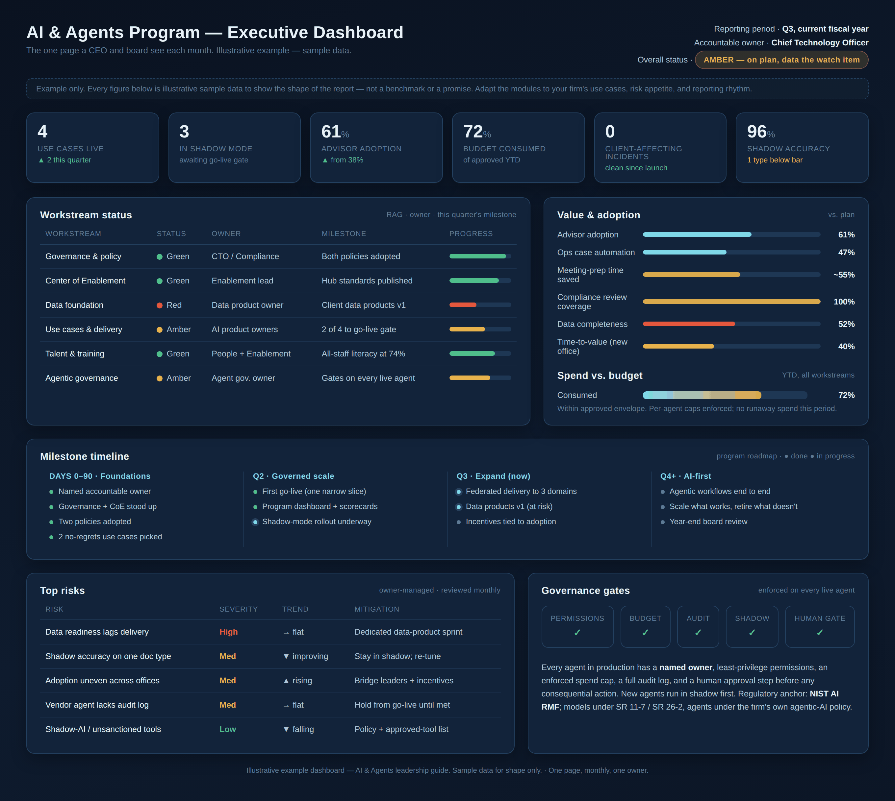

# Program management & the executive dashboard

**How the program is actually run between board meetings — the operating rhythm, the one page leadership reads, and the register that keeps risk honest. Everything here is an illustrative example; the numbers are sample data to show the shape.**

A strategy that is not managed is a slide deck. This document is the machinery that turns the preceding chapters into a program someone runs on a Tuesday: a fixed cadence, a single page that tells leadership the truth at a glance, and a discipline for surfacing risk before it becomes an incident. It exists because the most common way AI programs fail in regulated firms is not a bad model — it is a program nobody was actually managing, where pilots multiplied, no one could say what was live, and the board learned about a problem from a client rather than from a dashboard.

The image above is the artifact this whole document is about. It is deliberately a single page, because the discipline is the constraint: if the state of the program does not fit on one screen a CEO can read in three minutes, the program is being described, not managed. Read it as a worked example — the modules are the point, the figures are illustrative.

## The operating rhythm

Governance is a calendar, not a document. A program that meets when something goes wrong is not governed; one that meets on a fixed cadence, whether or not anything is wrong, is. Four loops run at four speeds, and each has one owner and one artifact.

The **weekly** loop is the delivery teams and the Center of Enablement: what shipped, what is stuck, what needs a decision. Its artifact is a short status, not a meeting for its own sake. The **monthly** loop is the executive review — the named AI owner takes the one-page dashboard above to the CEO and the executive team, walks the exceptions, and leaves with decisions on anything amber or red. The **quarterly** loop is the board's designated committee: the same evidence, read for oversight rather than execution — is the risk appetite still right, are the controls holding, is the roadmap real. And the **event-driven** loop fires on an incident, a regulatory change, or a go-live gate — it does not wait for the calendar.

The point of naming the four is that each higher loop reads the *same evidence* the lower one produced, at less detail and more altitude. The board is not handed a special board deck assembled the night before; it is handed the program's actual operating dashboard, quarter over quarter, so the trend is visible and the story cannot be re-narrated each meeting. That single fact — one source of truth, read at four altitudes — is what makes oversight real instead of performative.

## The one page, module by module

The dashboard has seven modules, and each answers a question a leader would otherwise have to ask.

**The status header** answers *"is the program on track, and who owns it?"* — a single overall RAG (red/amber/green), a named accountable owner, and the reporting period. In the example it is amber, "on plan, data the watch item," because honest amber is the most useful status a program can carry: it says *we are moving and here is the one thing I am worried about.* A dashboard that is always green is not being read; it is being managed for appearances.

**The KPI strip** answers *"what is true right now?"* in six numbers a leader can hold in their head: how many use cases are actually live, how many are in shadow mode awaiting a go-live gate, adoption, budget consumed against the approved envelope, client-affecting incidents, and shadow-mode accuracy. These are the vital signs. Note what is *not* here — no vanity count of "AI initiatives," no model benchmarks. Live, adopted, safe, and within budget: that is what leadership governs.

**Workstream status** answers *"where is the work, and who owns each part?"* — a RAG line per workstream (governance, enablement, data, delivery, talent, agentic governance), each with a *named* owner and this quarter's milestone. In the example, data foundation is red and delivery is amber, and that is the report doing its job: the constraint is visible, owned, and on the page, not buried. A workstream with no named owner is not a workstream; it is a wish.

**Value & adoption** answers *"is it worth it, and is anyone using it?"* — the two questions that kill programs when nobody tracks them. Value without adoption is a demo; adoption without value is activity. The bars pair them deliberately so leadership sees both at once, measured against plan rather than against zero.

**Spend vs. budget** answers *"are we inside the envelope, and are the cost controls real?"* This is where the AI Agent Policy's budget cap shows up as a number a CFO trusts: consumed against approved, with per-agent caps enforced so a retry loop is a stop, not a surprise invoice. Cost stewardship stops being a memo and becomes a line.

**The milestone timeline** answers *"are we following the roadmap?"* — the four phases from [chapter 06](06-getting-started-and-roadmap.md) (foundations, governed scale, expand, AI-first) with each milestone marked done or in progress. It puts this month inside the arc, so a leader can see not just where the program is but whether it is where the plan said it would be.

**Top risks** and **governance gates** together answer *"what could go wrong, and are the controls actually on?"* The risk register is owner-managed and reviewed monthly — severity, trend, and the specific mitigation, so risk is a managed list with directions of travel, not a static appendix. And the governance-gates row is the proof line: permissions, budget, audit, shadow, and the human gate, shown enforced on every live agent. It ties the whole page back to [the governance framework](07-governance-framework.md) and [the policies](09-ai-policies.md) — the five gates are not a philosophy here, they are a status light.

## The risk register, kept honest

The risks module deserves its own note, because a risk register is the part of any program most likely to rot into theater. Three rules keep it alive. Every risk has a **named owner** — the same discipline as everything else in this guide; a risk owned by "the team" is unowned. Every risk shows a **trend**, not just a severity — rising, flat, falling, improving — because the direction of travel is more decision-useful than the level, and it is what tells a board whether management is ahead of the risk or behind it. And every risk names a **specific mitigation** that someone is actually doing, so the register is a list of actions under way, not a list of worries acknowledged.

The example register makes the pattern concrete: data readiness lagging delivery (high, flat, met with a dedicated data-product sprint), a vendor agent without an audit log (held from go-live until the log requirement is met — the policy enforced as a decision), shadow-AI creeping in through unsanctioned tools (falling, because the approved-tool list and the acceptable-use policy are working). Each line is a control doing its job in public.

## What "good" looks like

A program is being managed well when the same one page appears every month, the reds and ambers change as issues are worked and closed, the risk trends move, and the board sees the identical artifact quarter over quarter at a higher altitude. It is being managed badly when a fresh, more flattering deck is assembled for each audience, when everything is green until it is suddenly a crisis, and when no single page can answer "what is live, is it adopted, is it safe, and are we inside budget."

Build this page early — before the first use case goes live, not after — because the act of designing it forces the questions the program must be able to answer, and standing it up empty is itself a forcing function for naming owners and defining what "live" means. The dashboard is not reporting on the program. Increasingly, it *is* the program.

---

*The dashboard above is a self-contained HTML file in this repo — [`playbooks/ai-program-dashboard.html`](../playbooks/ai-program-dashboard.html) — so you can open it, change the sample numbers, and adapt the modules to your own firm. Every figure in it is illustrative.*

---

**Next:** [11 — Recommended reading](11-recommended-reading.md) — the sources behind this guide, curated for each seat at the table.
